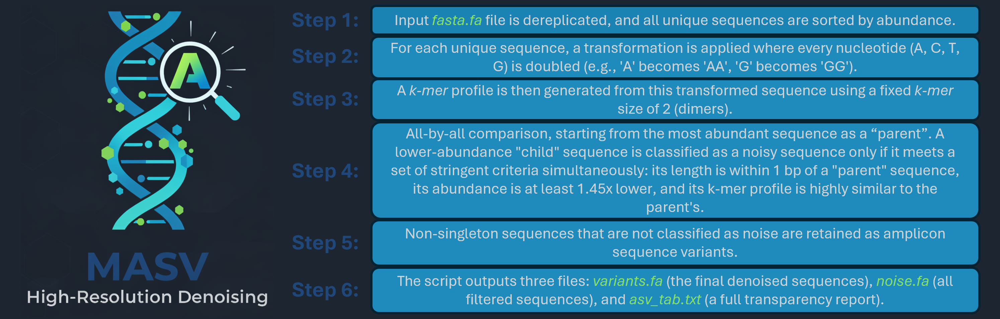

# MASV (current version 1.0.0)
## A high-resolution and transparent Python script for denoising amplicon sequence variants
MASV is a lightweight, transparent Python script for high-resolution denoising of amplicon sequencing data. It is designed to efficiently separate true, low-abundance sequence variants from sequencing noise. 
>  This script was originally designed for analsys of the data coming from Illumina based sequencing of fungal ITS region. It is particularly well-suited for high-resolution analyses, such as deep sequencing of single organisms from cultures or herbarium specimens, where the goal is to resolve the full spectrum of intra-species and allelic variation.
## Installation
The script is written for Python 3 and only uses standard libraries.  
No installation is required. MASV is a single standalone script.  
Simply download the masv100.py file.  
## General workflow  
  
> Full information on MASV's algorithm workflow can be found in this publication: link
## Usage
Run the script from your terminal. The two required arguments are the input FASTA file (-i) and the degree of freedom (-f).
```bash
python masv100.py -i <input.fasta> -f <degree_of_freedom>
```
Example:
```bash
python masv100.py -i sample_data.fasta -f 1
```
**Arguments**  
1. -i, --input_fasta (Required): Path to the input FASTA file.  
2. -f, --freedom (Required): An integer representing the "degree of freedom" for noise filtering. This value acts as a multiplier on the core denoising thresholds.  
3. -f 1: (Recommended) The most stringent (default) setting. It uses the empirically-derived base thresholds (4, 4, 2) designed to capture noise originating from a single nucleotide error.  
 -f 2: A more lenient setting. It doubles the thresholds (to 8, 8, 4), allowing variants with approximately two nucleotide differences to be classified as noise.  

**Output Files**  
MASV generates three files in the directory where it is run:  
1. variants.fa  
A FASTA file containing all sequences classified as "VARIANT".
> The header of each sequence includes a neighbors=... tag, which counts how many "NOISY VARIANT" sequences were associated with it.
2. noise.fa  
A FASTA file containing all sequences classified as "NOISY VARIANT" or "SPURIOUS VARIANT".
3. asv_tab.txt  
The "transparency report." This is a tab-delimited log file detailing the classification for every unique sequence.
> It lists the sequence's final description ("VARIANT", "NOISY VARIANT", etc.), its closest neighbor (if any), and the perfect k-mer, imperfect k-mer, and length difference metrics used for the decision.

## A note on thresholds (-f parameter)

The core thresholds (4, 4, 2) used by MASV are not arbitrary. They were empirically derived from an *in silico* simulation (see details in the publication).  
**Method**: 1,500 "child" sequences were generated from a "parent" *Russula* sp. ITS2 sequence.  Each child contained exactly one random SNP (n=750) or InDel (n=750).  
**Analysis**: Each of the 1,500 artificial "child" sequences was compared to the original, unaltered parent sequence.  
During each comparison, we calculated the three core metrics used by MASV to quantify sequence dissimilarity.  
*	Perfect k-mer difference (d[p]): The absolute difference in counts of 'perfect' k-mers (i.e., 'AA', 'CC', 'GG', 'TT').
*	Imperfect k-mer difference (d[im]): The absolute difference in counts of all other 'imperfect' k-mers (e.g., 'AC', 'AT', 'CA', etc.).
*	Net difference (d[net]): The value of the imperfect k-mer difference minus the perfect k-mer difference (d[im]−d[p]).   

**Result**: The maximum observed distortion from a single nucleotide error defined the base thresholds.
* Max d[p]: 4 
* Max d[im]: 4 
* Max d[net]: 2

Therefore, running MASV with -f 1 sets the filter to its most stringent, calibrated level, designed specifically to remove noise that is consistent with a single sequencing error.  
## Citation  
If you use MASV in your research, please cite:  
> MASV: A high-resolution and transparent Python script for denoising fungal amplicon sequence variants Vasilii Shapkin, Tomáš Větrovský, Miroslav Kolařík, Petr Kohout [Journal, Year]

