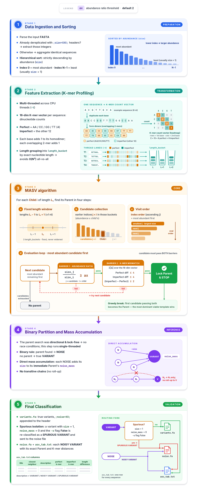
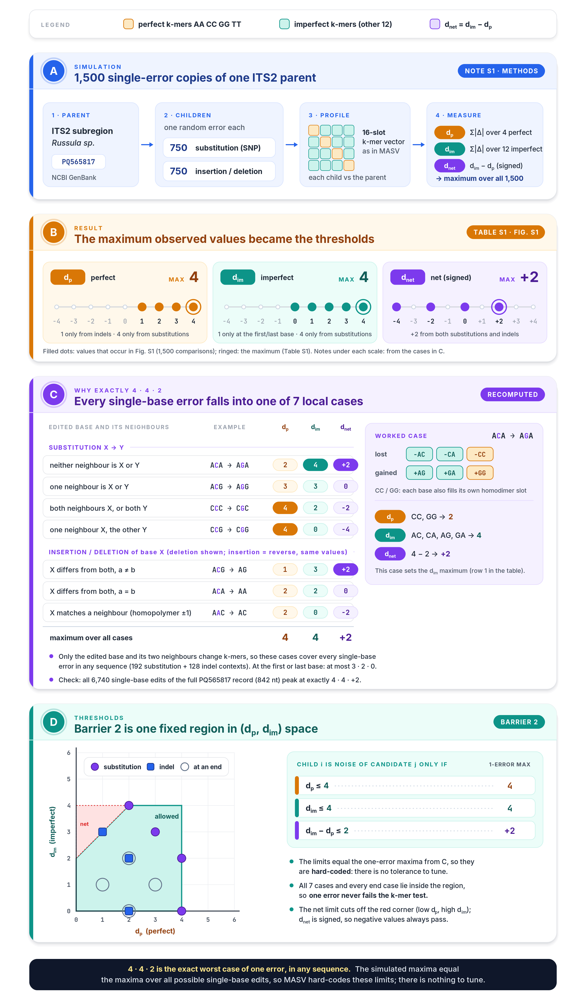
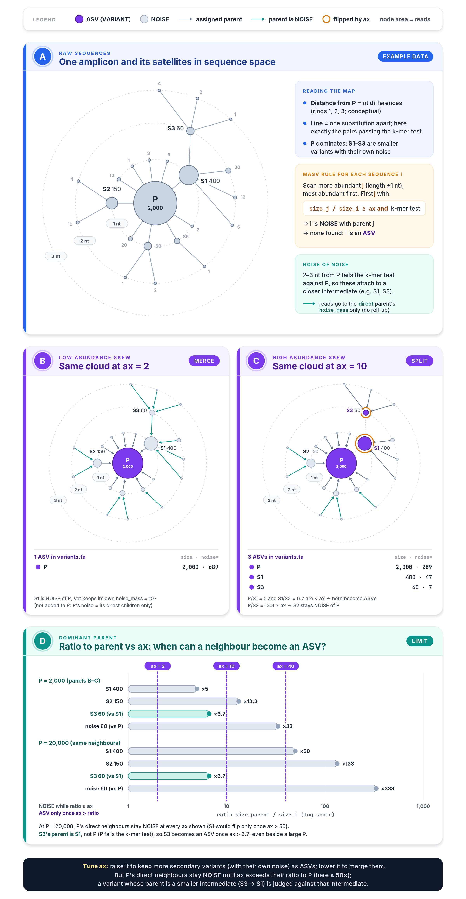

<h1 align="center">MASV</h1>

<p align="center">
  <b>High-resolution, transparent denoising of amplicon sequence variants</b><br>
  Separate true low-abundance variants from sequencing noise using k-mer profiles and abundance ratios.
</p>

<p align="center">
  <a href="LICENSE"></a>
  
  
</p>

<p align="center">
  <a href="#quick-start">Quick start</a> ·
  <a href="#how-it-works">How it works</a> ·
  <a href="#k-mer-thresholds">K-mer thresholds</a> ·
  <a href="#choosing-ax">Choosing ax</a> ·
  <a href="#parameters">Parameters</a> ·
  <a href="#output-files">Outputs</a> ·
  <a href="#citation">Citation</a>
</p>

---

## Why MASV

MASV separates real low-abundance sequence variants from sequencing noise. It is a good fit for high-resolution work, such as deep sequencing of single organisms from cultures or herbarium specimens, where you want to resolve the full range of intra-species and allelic variation.

- **Transparent.** Every unique sequence gets a row in `asv_tab.txt` that shows its label, its parent when it has one, and the k-mer metrics behind the decision.
- **Lightweight.** MASV 2.0.0 is one C++17 source file. Build it with `g++`; there are no libraries to install.
- **Calibrated.** The k-mer limits are the worst case of one nucleotide error (see [k-mer thresholds](#k-mer-thresholds)).
- **Marker-agnostic.** MASV was built for Illumina sequencing of the fungal ITS region, but the core algorithm doesn't depend on the marker. You can use it on amplicon HTS data from any molecular marker or organism.

## Quick start

Build [`masv.cpp`](masv.cpp) and run it on a FASTA file of reads:

```bash
g++ -O3 -std=c++17 -pthread masv.cpp -o masv
./masv -i input.fasta -t 4
```

MASV dereplicates the file and sorts the unique sequences by abundance. Each FASTA record counts as one read, unless its header already contains `size=`, in which case that count is used. Identical sequences are merged, and the first header is kept. Sequences may contain only `A`, `C`, `G`, and `T` (any case). An ambiguous base stops the run with an error. The three result files are written to the current directory.

Example with the defaults written out:

```bash
./masv -i input.fasta -a 2 -s False -t 2
```

A demo is coming soon.

## How it works

<p align="center">
  <a href="docs/img/masv-workflow.png">
    
  </a>
  <br><sub>The default ax is 2.</sub>
</p>

1. **Ingest and sort.** MASV dereplicates the reads and sorts the unique sequences from most to least abundant.
2. **Profile.** Each sequence becomes a 16-slot dinucleotide count. Every base also increments its own homodimer (`AA`, `CC`, `GG`, `TT`), which is the same as doubling each base and then counting dimers.
3. **Compare.** Each sequence looks for a parent among earlier sequences in that list (equally or more abundant) whose length is within ±1 nt. Candidates are tried from most abundant to least, and the first one that passes both barriers is the parent. The search is parallel (`-t` threads).
    - **Abundance:** `size_parent / size_child ≥ ax`
    - **K-mer:** perfect-dimer difference ≤ 4, imperfect-dimer difference ≤ 4, and (imperfect − perfect) ≤ 2
4. **Accumulate.** A sequence that found a parent is noise, and its abundance is added to that parent's noise mass. This sum runs one sequence at a time after the parallel search finishes.
5. **Label.** A sequence with a parent is a `NOISY VARIANT`. A sequence with no parent is a `VARIANT`. A single read with no parent and noise mass 0 is a `SPURIOUS VARIANT` (with `-s True` it stays a `VARIANT`).

> The full algorithm will be described in the manuscript, which is in preparation.

## K-mer thresholds

<p align="center">
  <a href="docs/img/masv-kmer-calibration.png">
    
  </a>
</p>

The k-mer limits are fixed at 4, 4, and 2. A candidate passes only when the perfect-dimer difference is at most 4, the imperfect-dimer difference is at most 4, and (imperfect − perfect) is at most 2. Those values are the exact worst case of a single nucleotide error, measured on 750 random SNPs and 750 random indels of one *Russula* sp. ITS2 parent. They are not a command-line setting.

> [!IMPORTANT]
> Long-read technologies (e.g. PacBio, Oxford Nanopore) have very different error profiles and rates. These limits were set on Illumina single-error noise. Using MASV directly on data from these or other non-Illumina platforms will likely give suboptimal results. Re-evaluate the abundance ratio first.

## Choosing ax

<p align="center">
  <a href="docs/img/masv-sequence-space.png">
    
  </a>
  <br><sub>The default ax is 2.</sub>
</p>

`ax` (`-a`) is the setting with the most influence on the result. **Raising ax** keeps more secondary variants as ASVs, along with their own noise. **Lowering ax** merges them into their dominant parent. Even so, when a parent is very abundant, its close neighbors stay noise until `ax` is larger than their abundance ratio to that parent. That's why it pays to try a few values on your own data.

The default is **2**.

## Parameters

| Flag | Meaning | Default |
|---|---|---|
| `-i` | Input FASTA file (**required**) | – |
| `-a` | Abundance ratio (`ax`), the minimum *parent size / child size* needed to call a sequence noise | `2` |
| `-s` | `True` or `False`. `True` keeps a single-read sequence that has no parent and no noise mass in `variants.fa`, labeled `VARIANT`. Any other value leaves it in `noise.fa`, labeled `SPURIOUS VARIANT`. Only the exact string `True` changes the default. | `False` |
| `-t` | Worker threads for k-mer counting and the parent search | `2` |

These are the only flags the program reads.

## Output files

MASV writes three files in the current directory. Sequence titles keep the first FASTA header. When that header has no `size=` field, MASV appends `;size=N;`, where `N` is the merged abundance. A header that already contains `size=` is kept as written, including when later copies of the same sequence add to its abundance.

| File | Contents |
|---|---|
| `variants.fa` | Sequences labeled `VARIANT`. Each header is the sequence title with `noise=N;` appended. `N` is the total abundance of the `NOISY VARIANT` sequences that took this sequence as their direct parent. With `-s True`, parentless single-read sequences that accumulated no noise are written here too, with `noise=0;`. |
| `noise.fa` | Sequences labeled `NOISY VARIANT`, plus `SPURIOUS VARIANT` singletons when `-s` is not `True` (the default). Each header is the sequence title alone. |
| `asv_tab.txt` | Tab-separated report, one row per unique sequence, in abundance order. The header row is `title`, `closest neighbor(s)`, `description`, `perfect k-mer`, `imperfect k-mer`, `length difference`. `description` is `VARIANT`, `NOISY VARIANT`, or `SPURIOUS VARIANT`. For a `NOISY VARIANT`, the neighbor column is its parent title and the last three columns are the perfect-dimer difference, the imperfect-dimer difference, and the absolute length difference. For a `VARIANT` or `SPURIOUS VARIANT`, those four fields are `*`. |

## Citation

If you use MASV in your research, please cite:

> Vasilii Shapkin, Miroslav Kolařík, Petr Kohout, Tomáš Větrovský. *MASV: A high-resolution and transparent Python script for denoising fungal amplicon sequence variants.* Manuscript in preparation.

## License

MASV is released under the [GNU General Public License v3.0](LICENSE).
